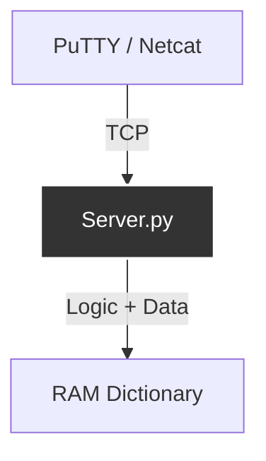
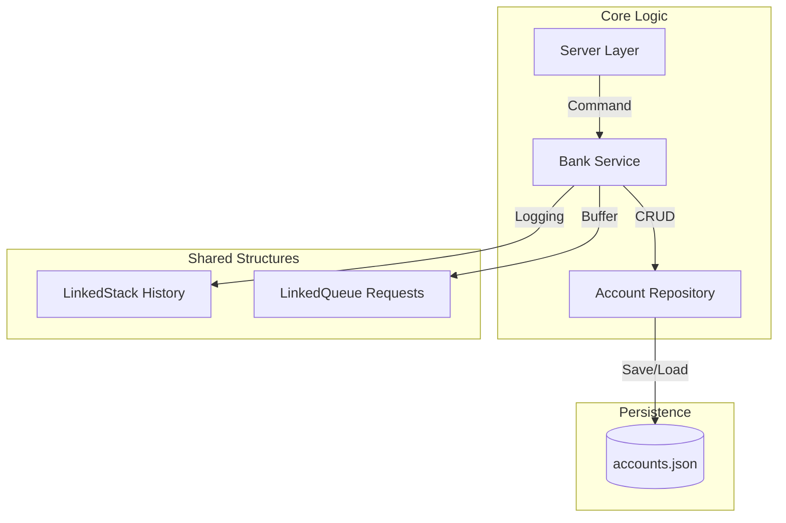
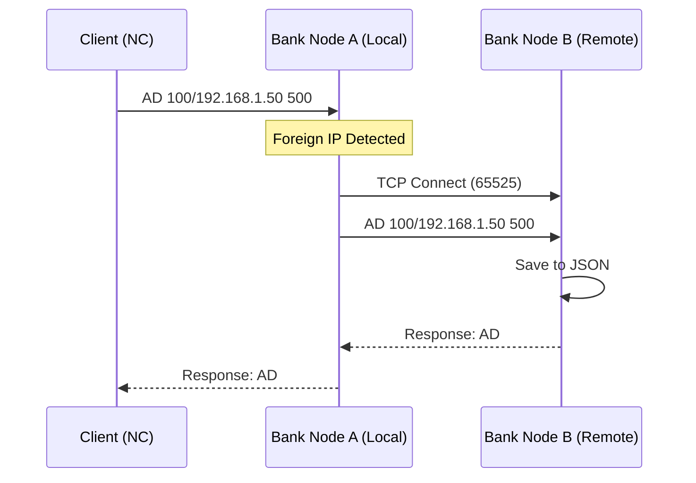

# P2P Banking Node

**Author:** Dominik Hoch    
**School:** SPŠE Ječná  
**Class:** C4b  
**Course:** Software Engineering (PV) / Network Applications (PSS)  
**Date:** January 2026

---

## Documentation & Architecture Evolution

This project was developed iteratively, evolving from a simple TCP server into a modular distributed system. The following sections describe the development phases and architectural decisions.

### Phase 1: Monolithic TCP Server (Basic Node)
The initial goal was to establish basic network communication. The application was designed as a simple server accepting text commands and returning responses.
* **Goal:** Implement `socket` communication and `threading`.
* **Problem:** All logic (networking, banking rules, data storage) was mixed together in one place.

### Phase 2: Layered Architecture & Code Reuse (Refactoring)
To ensure maintainability and scalability, the application was refactored into distinct layers, integrating code from previous projects (Code Reuse).
* **Network Layer (`server.py`):** Handles connection management only.
* **Service Layer (`bank_service.py`):** The "Brain" of the bank. Handles business logic.
* **Data Layer (`repository.py`):** JSON persistence (Adapted from the *ImageProcessing* project).

### Phase 3: Peer-to-Peer Communication (Essentials)
The final phase implemented distributed system logic. The Bank Node now acts in a dual role – as a **Server** (listening) and a **Client** (sending).
* **Detection:** If an `AD` (Deposit) command targets a foreign IP, `BankService` creates a new TCP connection instead of processing data locally.

##️ Code Reuse Strategy

This project demonstrates the ability to integrate existing, tested components into a new context to speed up development.

| Component | Origin | Usage in Original Project | Implementation in Banking Node |
| :--- | :--- | :--- | :--- |
| **AccountRepository** | Project *ImageProcessingPipeline* | `CSVExporter` used for saving image metadata and processing logs into CSV files. | Adapted to `JSONRepository` for persistent storage of bank accounts and balances. |
| **LinkedStack** | Course Task *Algorithmic Thinking* | Used for bracket validation or Undo/Redo operations. | **Audit Log:** Stores transaction history (LIFO) to track latest changes efficiently. |
| **LinkedQueue** | Course Task *Algorithmic Thinking* | Used for print job scheduling simulation. | **Request Buffer:** Buffers incoming TCP commands (FIFO) before processing to prevent loss. |
| **Socket Server** | Course Task *PSS (16.1-16.3)* | Simple Echo Server / Chat application. | **Core Network Layer:** Multithreaded TCP server handling parallel P2P connections. |
| **Unit Tests** | Course Task *Testing (11.1)* | Testing basic calculator functions (`add`, `sub`). | **Financial Validation:** Validates atomic operations (deposit/withdraw) and error handling. |

### References to Original Repositories
* **Image Processing Pipeline:** https://github.com/hoch12/image-processing-pipeline.git

---

## User Manual

### 1. Installation & Setup
The project runs on **Python 3.9+** and uses only standard libraries.

**Step 1: Clone the repository**

    git clone https://github.com/hoch12/p2p-banking-node.git
    cd p2p-banking-node

**Step 2: Create Virtual Environment (Recommended)**
It is best practice to run the application in an isolated environment.

    # MacOS / Linux
    python3 -m venv .venv
    source .venv/bin/activate

    # Windows
    python -m venv .venv
    .venv\Scripts\activate

**Step 3: Start the Server**
You can customize the server behavior using command-line arguments.

    python main.py [--port PORT] [--ip IP_ADDRESS]

**Configuration Options:**

| Argument | Default | Description |
| :--- | :--- | :--- |
| `--port` | `65525` | The TCP port to listen on. Range 65525-65535 is recommended to avoid conflicts. |
| `--ip` | `0.0.0.0` | The network interface to bind to.  • `0.0.0.0`: Accept connections from **anywhere** (WiFi/LAN).  • `127.0.0.1`: Accept connections **only from this computer** (Localhost). |

**Examples:**
* **Public Mode (School/LAN):** `python main.py` (Default)
* **Safe Mode (Local testing):** `python main.py --ip 127.0.0.1`
* **Custom Port:** `python main.py --port 65530`

### 2. Connection & Usage
To interact with the bank, open a new terminal window and connect using Netcat (Mac/Linux) or PuTTY (Windows).

    nc localhost 65525

### 3. Protocol Commands (Reference)
The server accepts the following text commands:

| Command | Description | Example |
| :--- | :--- | :--- |
| **BC** | **Bank Check.** Returns the IP/ID of the node. | `BC` → `BC 127.0.0.1` |
| **AC** | **Account Create.** Generates a new unique account ID. | `AC` → `AC 49123/127.0.0.1` |
| **AD** | **Account Deposit.** Adds funds. **P2P:** Forwards if IP is remote. | `AD 49123/127.0.0.1 500` |
| **AW** | **Account Withdraw.** Removes funds. Checks for overdraft. | `AW 49123/127.0.0.1 200` |
| **AB** | **Account Balance.** Returns current funds. | `AB 49123/127.0.0.1` |
| **BN** | **Bank Number.** Returns the count of local accounts. | `BN` → `BN 5` |
| **BA** | **Bank Amount.** Returns total liquidity (sum of all balances). | `BA` → `BA 15000` |

### 4. Testing
To verify the system integrity and logic, run the automated test suite:

    python -m unittest discover tests -v